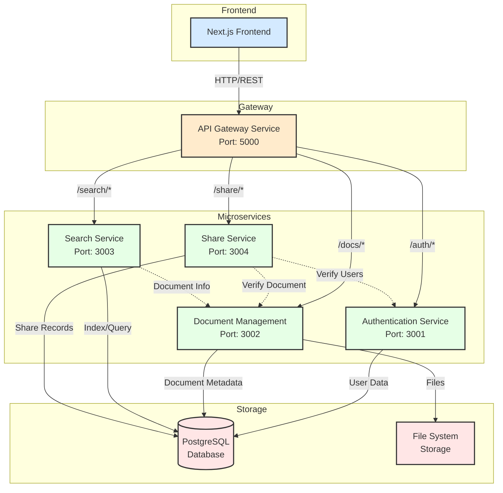
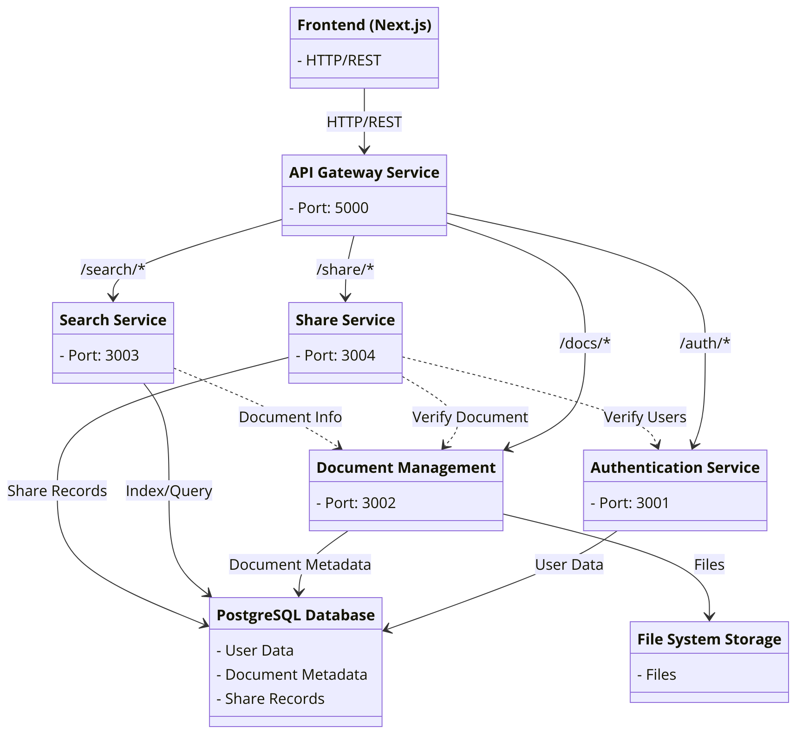

# DocStorage

## Overview

**DocStorage** is a microservice-based document management system that allows users to securely store, manage, and share documents. The system features a modern React frontend and a microservices backend architecture. It is a simplified version of the on-going InfoVault project.

## Features

- **User Authentication**
  - Secure registration and login
  - JWT-based authentication
  - Session management

- **Document Management**
  - File upload with drag-and-drop support
  - Multi-file upload capability
  - File preview (images, PDFs)
  - Secure document download
  - Thumbnail generation for images
  - Recent files tracking

- **User Interface**
  - Responsive dashboard
  - Grid view for documents
  - File type icons
  - Search functionality
  - Preview modal for supported formats

## Tech Stack

### Frontend
- **Framework:** Next.js 14
- **UI Library:** React 18
- **Styling:** Tailwind CSS
- **Icons:** Material Symbols
- **State Management:** React Hooks

### Backend
- **API Gateway:** Flask
- **Authentication Service:** Flask + JWT
- **Document Service:** Flask + Local Storage
- **Database:** PostgreSQL
- **File Storage:** Local filesystem (configurable)

## Architecture

### Microservices
1. **API Gateway** (Port: 5000)
   - Routes requests to appropriate services
   - Handles CORS and basic request validation
   - Manages service discovery

2. **Authentication Service** (Port: 3001)
   - User registration and login
   - JWT token generation and validation
   - User profile management

3. **Document Management Service** (Port: 3002)
   - File upload and storage
   - Document metadata management
   - File preview and thumbnail generation
   - Recent files tracking

4. **Search Service** (Port: 3003) [Planned]
   - Document search functionality
   - Metadata indexing
   - Full-text search capabilities

5. **Share Service** (Port: 3004) [Planned]
   - Document sharing between users
   - Allow users to share documents with other registered users via their unique ID (email) so they see the same document in their own DocStorage.
   - Store shared document information (such as document ID, sharer, and recipient).
   - Access control management
   - Handle permissions for shared documents (e.g., view-only, download).
   - Ability to revoke document access.

## System Architecture (UML)



This UML diagram illustrates:
- The frontend Next.js application
- The API Gateway that routes requests
- Four microservices (Auth, Document Management, Search, and Share)
- Storage systems (PostgreSQL and File System)
- Service interactions and dependencies
- Port assignments for each service

## Project Structure

```bash
docstorage/
├── services/
│   ├── auth_service/          # Authentication Service
│   │   ├── app/
│   │   │   ├── __init__.py
│   │   │   ├── models/
│   │   │   │   ├── __init__.py
│   │   │   │   └── user.py
│   │   │   ├── routes/
│   │   │   │   ├── __init__.py
│   │   │   │   └── auth.py
│   │   │   └── extensions.py
│   │   ├── config.py
│   │   ├── requirements.txt
│   │   └── run.py
│   │
│   ├── doc_mgmt_service/      # Document Management Service
│   │   ├── app/
│   │   │   ├── __init__.py
│   │   │   ├── models/
│   │   │   │   ├── __init__.py
│   │   │   │   └── document.py
│   │   │   ├── routes/
│   │   │   │   ├── __init__.py
│   │   │   │   └── documents.py
│   │   │   └── utils/
│   │   │       ├── __init__.py
│   │   │       └── auth.py
│   │   ├── config.py
│   │   ├── requirements.txt
│   │   └── run.py
│   │
│   ├── search_service/        # Search Service
│   │   └── run.py
│   │
│   └── share_service/         # Share Service
│       └── run.py
│
├── frontend/
│   ├── src/
│   │   ├── app/
│   │   │   ├── dashboard/
│   │   │   │   └── page.tsx
│   │   │   ├── files/
│   │   │   │   └── page.tsx
│   │   │   ├── login/
│   │   │   │   └── page.tsx
│   │   │   ├── register/
│   │   │   │   └── page.tsx
│   │   │   └── uploadFiles/
│   │   │       └── page.tsx
│   │   ├── components/
│   │   │   ├── Footer.tsx
│   │   │   ├── Navigation.tsx
│   │   │   └── ShareModal.tsx
│   │   └── styles/
│   │       └── globals.css
│   ├── public/
│   │   └── assets/
│   └── package.json
│
├── DocStorageDocuments/       # Document storage directory
│
├── scripts/                   # Utility scripts
│
├── tests/                     # Test files
│   └── test_doc_service.py
│
├── main.py                    # API Gateway Service
├── start_services.py          # Service orchestration script
├── requirements.txt           # Global Python dependencies
└── README.md                  # Project documentation
```

## UML Sequence Diagram
This UML sequence diagram details the interaction between the main program, reminder microservice, and external APIs (SendGrid and Twilio).



## Setup Instructions

[Detailed setup instructions moved to docs/setup.md]

## API Documentation

[API documentation moved to docs/api.md]

## Contributing

1. Fork the repository
2. Create a feature branch
3. Commit your changes
4. Push to the branch
5. Create a Pull Request

## License

This project is licensed under the MIT License - see the LICENSE file for details.
