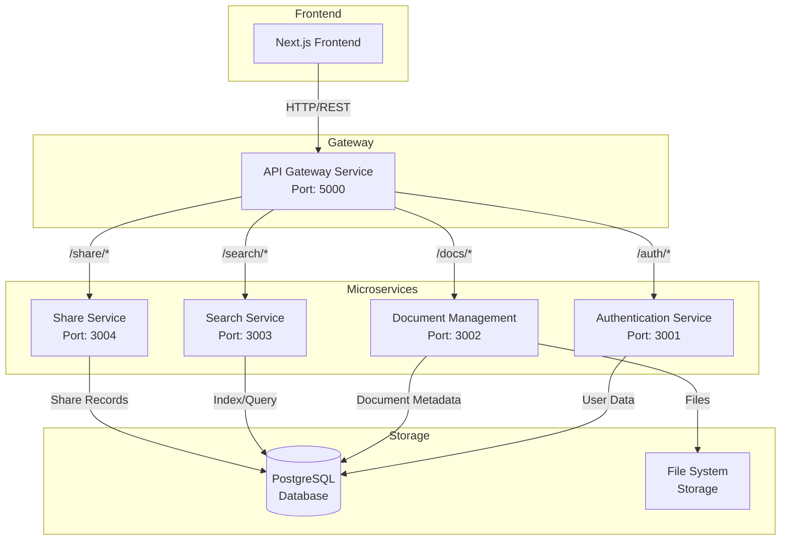

# Architecture Documentation

## System Overview

DocStorage uses a microservices architecture to provide scalable, maintainable, and secure document management capabilities. Each service is independently deployable and maintains its own database schema.

## Architecture Diagram


## Service Descriptions

### 1. API Gateway (Port: 5000)
- **Purpose**: Central entry point for all client requests
- **Responsibilities**:
  - Request routing
  - Authentication verification
  - CORS handling
  - Load balancing
  - Service discovery
- **Technologies**:
  - Flask
  - Flask-CORS
  - Requests library

### 2. Authentication Service (Port: 3001)
- **Purpose**: Handle user authentication and authorization
- **Responsibilities**:
  - User registration
  - Login/logout
  - JWT token management
  - Password hashing
  - Session management
- **Technologies**:
  - Flask
  - JWT
  - bcrypt
  - PostgreSQL

### 3. Document Service (Port: 3002)
- **Purpose**: Manage document operations
- **Responsibilities**:
  - File upload/download
  - Document metadata
  - File type validation
  - Thumbnail generation
  - Recent files tracking
- **Technologies**:
  - Flask
  - PostgreSQL
  - Pillow (for image processing)

### 4. Search Service (Port: 3003)
- **Purpose**: Provide document search capabilities
- **Responsibilities**:
  - Full-text search
  - Metadata indexing
  - Search result ranking
  - Query optimization
- **Technologies**:
  - Flask
  - PostgreSQL

### 5. Share Service (Port: 3004)
- **Purpose**: Enable document sharing
- **Responsibilities**:
  - Access control
  - Share file 
  - Permission management
  - Share history tracking
- **Technologies**:
  - Flask
  - PostgreSQL
  - Redis (planned)

## Data Flow

1. **Authentication Flow**
```
Client → Gateway → Auth Service → Auth DB → Gateway → Client
```

2. **Document Upload Flow**
```
Client → Gateway → Auth Check → Doc Service → File System + Doc DB → Client
```

3. **Document Retrieval Flow**
```
Client → Gateway → Auth Check → Doc Service → File System → Client
```

## Security Measures

1. **Authentication**
   - JWT-based authentication
   - Token expiration
   - Password hashing with salt
   - HTTPS enforcement

2. **Authorization**
   - Role-based access control
   - Document ownership verification
   - Service-level authorization

3. **Data Protection**
   - Encrypted file storage
   - Secure file transfer
   - Database encryption

## Scalability Considerations

1. **Horizontal Scaling**
   - Stateless services
   - Load balancer ready
   - Database replication support

2. **Performance Optimization**
   - Caching layer (planned)
   - Asynchronous processing
   - Database indexing

3. **Resource Management**
   - File size limits
   - Rate limiting
   - Connection pooling

## Monitoring and Logging

1. **Service Health**
   - Health check endpoints
   - Service status monitoring
   - Resource usage tracking

2. **Logging**
   - Centralized logging
   - Error tracking
   - Audit trails

3. **Metrics**
   - Request/response times
   - Error rates
   - System resource usage

## Future Enhancements

1. **Technical Improvements**
   - Implement caching layer
   - Add message queues
   - Set up service discovery
   - Add real-time notifications

2. **Feature Additions**
   - Document versioning
   - Collaborative editing
   - Advanced search
   - Automated backups

3. **Security Enhancements**
   - Two-factor authentication
   - File encryption at rest
   - Enhanced audit logging
   - IP whitelisting 